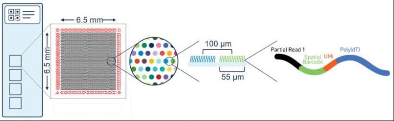

## 2026 V4SDB Student Summer School
### Visium workshop

In this workshop we will go step by step through the analysis of Visium data from 10x
Genomics. All the code is provided so you are not asked to write it yourself, but to read
each step carefully and understand what it does and why. We will load the data, filter it,
process it, and cluster it on a single tissue section. If time allows, all the steps are
then repeated on three sections of different developmental ages simultaneously, where more advanced
analyses are suggested. If we do not get there together, you are welcome to work through it
on your own and contact me with any questions.

### What Visium measures

A Visium slide carries a grid of ~5,000 spots, each 55 µm across and spaced 100 µm apart 
(distance from center to center of spots). Every spot carries millions of capture oligos 
sharing one **spatial barcode** unique to that position. 
When a tissue section is placed on the slide and permeabilised, mRNA diffuses down
into the spots and is captured by a poly-T sequence that binds the poly-A tail of the
transcript. After sequencing, the barcode tells us *where* on the slide a transcript came
from, and the rest of the read tells us *which gene* it was.

Two consequences shape everything that follows. 

- First, a spot is a fixed position, not a cell: at 55 µm it typically covers a handful of cells, so what we measure is a local mixture.
- Second, poly-A capture is indiscriminate: any polyadenylated transcript is sequenced, whether or not we are interested in it. A large part of this workshop is deciding what to keep.




### Where this data comes from

The sections we analyse today are a small subset of a published atlas of the
developing human heart, produced in our lab:

> Lázár, E.\*, Mauron, R.\*, Andrusivová, Ž.\* et al. Spatiotemporal gene
> expression and cellular dynamics of the developing human heart.
> *Nature Genetics* **57**, 2756–2771 (2025).
> [doi:10.1038/s41588-025-02352-6](https://doi.org/10.1038/s41588-025-02352-6)
> (\*equal contribution)

The full study combined Visium spatial transcriptomics on 16 hearts (38 sections,
69,114 spots, PCW 6–12) with single-cell RNA-seq on 15 hearts (76,991 cells,
PCW 5.5–14) and in situ sequencing of 150 transcripts. Unsupervised clustering of
25,208 spots from 17 sections yielded 23 spatial clusters corresponding to the
major structural components of the developing heart, and deconvolution against the
single-cell data mapped 72 fine-grained cell states onto tissue positions.

Today we work with three sections. Everything we do is a simplified version of the
first steps of that pipeline.

**Resources you can use during and after the workshop:**

- Interactive viewer: <https://hdcaheart.serve.scilifelab.se>
- Full analysis code: <https://github.com/rmauron/HDCA_heart_dev>
- Processed data (Mendeley): <https://doi.org/10.17632/fhtb99mdzd.1>
  and <https://doi.org/10.17632/w65jtfsvpr.1>

The tissue was donated after elective medical abortion with written informed
consent, under Swedish ethical permit 2018/769-31.


### By the end of the session you will have

**On a single section:**

- Loaded a Visium section into R and plotted a gene on the tissue
- Decided which genes to filter out, and justified why
- Normalized, scaled, and reduced the data
- Clustered the spots and mapped the clusters back onto the anatomy
- Found the genes that define each cluster, and compared them against the
  published atlas

**On three sections of different ages:**

- Repeated the whole pipeline on three sections at once
- Seen what a batch effect looks like, and what correcting it costs
- Looked for genes that change with developmental stage within a cluster
- Asked whether a variable gene is actually spatially structured

### Practical notes

Grey boxes are **code chunks**. Run the chunk your cursor is in with
`Cmd/Ctrl + Shift + Enter`, or a single line with `Cmd/Ctrl + Enter`.

Run them in order, top to bottom. Many steps deliberately overwrite an object
with an updated version, so skipping one, or re-running an earlier one out of
order, will produce confusing errors later. Three places to be aware of:

- The single-section analysis builds up an object called `object`.
- The three-section analysis uses a separate object called `se`. The two are
  independent — `object` is not affected by anything in the second half.
- In section 7 we cluster twice and `FindClusters()` writes to the same
  `seurat_clusters` column both times. We copy the result into `clusters_pca`
  and `clusters_harmony` so that nothing is lost, but if you re-run only part
  of that chunk, `seurat_clusters` may not hold what you expect.

Red text in the console is not always an error; warnings are common and usually
harmless. If something breaks, say so and we will look at it together.

## Set up

### Set project library

When working in R, there is multiple ways to set up your working environment. For the sake of that workshop, you are provided with a fully working environment that contains the code, the data, and the R packages already installed. Below we are just specifying R where to look for the installed packages.

```{r}
#| label: setup
#| include: false

.libPaths("/home/raphael.mauron/miniconda3/envs/VisiumHD/lib/R/library") # set project library

.libPaths() # check project library

lapply(.libPaths()[1], list.files) # check library
```

### Load library

R packages might be installed, but for us to be able to use them later in the analysis, we have to attach them to our session. In R, we do it by using the `library()` function. This slightly more advanced way below, allow to call the function `library()` in a loop. You could also do: `library(semla) library(Seurat) etc.` This works equally well.

```{r}
#| label: load packages
package.list <- c("tidyverse", "semla", "Seurat", "patchwork", "RColorBrewer", "harmony")

invisible(lapply(package.list, function(element) {
  library(element, character.only = TRUE)
}))
rm(package.list)
```

### Set seed for project

Sometimes, some code and functions rely on some random drawing of numbers. For instance, if I tell R to sample 100 random cells from my single-cell RNA-seq data, everytime I run the function, I will have different randomly picked cells. It does what we ask, but for the sake of reproducibility, we want to have always the same cells picked when we run the same code the next day. To do so, we can specify a seed by using `set.seed()`. Some functions have that option in the function's parameter (worth checking because it might not be used by default), but otherwise you can use `set.seed()` with any number you want **in the code chunk where you need it**.

```{r}
set.seed(1)
```

## Loading my first Visium section

Our session is now fully ready to start. We have the packages loaded, we are ready to load some data.

To analyse a [Visium](https://www.10xgenomics.com/platforms/visium/product-family?&utm_medium=search&src=search&utm_source=google&lss=google&utm_term=10x%20visium&useroffertype=website-page&utm_content=website-page&utm_campaign=701KW0000019A9zYAE&cnm=701KW0000019A9zYAE&cid=701KW0000019A9zYAE&usercampaignid=701KW0000019A9zYAE&gad_source=1) section, we need to load the data. [10x Genomics](https://www.10xgenomics.com/) provides a software ([spaceranger](https://www.10xgenomics.com/support/software/space-ranger/latest)) that takes the raw sequences and the microscopy images, and generates a `count matrix` (gene counts per barcode), and several files that help us align the microscopy image to the count matrix.

### How do we load this count matrix in R?

In R, scientists have developed convenience packages to effortlessly load the `spaceranger` outputs, store them into an object class, and provide multiple functions to analyse, plot and else.

In the single-cell RNA seq world, such a convenience package is `Seurat`, and is very well established and maintained by a large team. They are at the origin of the object class that we call `Seurat object`.

When Spatial Transcriptomics appeared, there were no such toolkit, so other labs put effort into creating such a package. Today we will rely on the [`semla`](https://github.com/spatial-research/semla) package developed in our lab ([Lundeberg](https://www.spatialresearch.org/)). `semla`, under the hood, uses the `Seurat object` class, but added a way to register the spatial information that single-cell data do not have (image, coordinates, etc.).

In the next steps, most functions we will use come from either `semla` or `Seurat`.

### Load data & create infoTable from metadata + spaceranger outs

Let's start!

Below we create a table that provides the path so R (and specific packages e.g., *semla*) knows where the `spaceranger outputs` are. We have here:

1.  `filtered_feature_bc_matrix.h5` : the count data
2.  `tissue_hires_image.png` : an H&E image that can be aligned to the counts
3.  `tissue_positions_list.csv`: a table that contains the info to align the pixel of the image and the Visium spots
4.  `scalefactors_json.json`: a ratio value that help us visualize the image and the spots in the right scale.

```{r}
data_root_directory <- file.path("./data/spaceranger/V10F24-105_C1")

samples <- Sys.glob(paths = file.path(data_root_directory, "filtered_feature_bc_matrix.h5"))
imgs <- Sys.glob(paths = file.path(data_root_directory, "spatial", "tissue_hires_image.png"))
spotfiles <- Sys.glob(paths = file.path(data_root_directory, "spatial", "tissue_positions_list.csv"))
json <- Sys.glob(paths = file.path(data_root_directory, "spatial", "scalefactors_json.json"))
```

We create a table containing all these paths

```{r}
infoTable <- tibble(samples,
                    imgs,
                    spotfiles,
                    json)
```

We can inspect the table:

```{r}
infoTable
```

We can now use `ReadVisiumData()` function from *semla* package to create an R-object with all the data we linked with their paths in the `infoTable`. *semla* uses the data structure from the well-known *Seurat* package, originally developed to facilitate the analysis of *single-cell RNA-seq* data. *semla* added, on top of this architecture, all the spatial information (image, coordinates, etc.) that are required for us to know where are the spots and to be able to later use this information in analyses and visualization.

```{r}
object <- ReadVisiumData(infoTable)
object <- LoadImages(object) #we specify semla to load the image in the object
```

Let's inspect what we have so far.

```{r}
object
```

### Question:

1.  What is the dimension of the data?
2.  How many spots does that section contain?
3.  How many genes does that section contain?
4.  Does it make sense?

`Hint`: look at the printed object!


### What are we actually looking at?

Before we touch the data, it is worth spending two minutes on the tissue. Everything we do
from here on produces coloured dots on this image, and those dots only mean something if
you know what is underneath them.

This section is a PCW **10** human heart, cryosectioned at 10 µm. At this stage the four
chambers are formed and the heart is growing and maturing rather than being built from
scratch. Depending on the cutting plane you should be able to make out:

- **Compact myocardium** — the dense outer wall of the ventricles
- **Trabeculated myocardium** — the sponge-like inner ventricular wall, with deep recesses
  opening into the lumen
- **Atrial wall** — thinner, smoother, above the atrioventricular plane
- **Interventricular septum** — the wall between the two ventricles
- **Valve region / endocardial cushions** — pale, loosely packed mesenchyme at the
  atrioventricular plane
- **Chamber lumens** — empty space, often full of blood
- **Epicardium** — the thin layer at the outer surface

```{r}
#| fig-height: 6
ImagePlot(object)
```

Two features of this image will explain a lot of what we see later. The lumens are holes:
there is no tissue there, so spots covering them capture very little RNA. And the wall
thickness varies enormously across the section, so the amount of tissue under a 55 µm spot
is far from constant. Neither is a technical problem — both are anatomy — but both show up
in every quality metric we are about to plot.

We can start orienting ourselves molecularly straight away. *MYH6* and *MYH7* are the atrial
and ventricular myosin heavy chains, so plotting them together separates the upper and lower
halves of the heart:

```{r}
MapFeatures(
  object    = object,
  slot      = "counts",
  features  = c("MYH6", "MYH7"),
  pt_size   = 1,
  image_use = "raw"
)
```

### Question

1. Which regions light up for *MYH6*, and which for *MYH7*? Does that match where you
   expected the atria and ventricles to be?
2. Find a region where neither is expressed. What is there instead?
3. Try `TNNT2` (all cardiomyocytes), `COL1A1` (mesenchyme and valves) or `PECAM1`
   (endothelium and endocardium). Where does each sit?

::: {.callout-tip}
## Keep this image in mind
When we cluster the spots later, come back to this section. Clusters that trace a
recognisable structure are believable. Clusters that scatter across unrelated regions
usually reflect a technical gradient rather than biology.
:::


### Cleaning up a bit...

We see about twice as many unique genes as there are human protein-coding genes. Our data comes from poly-A capture, so every polyadenylated transcript gets sequenced — including a lot we did not set out to measure.

Four families are worth removing. All are very highly expressed, so they eat a large share of each spot's counts, and all vary for reasons unrelated to the anatomy we want to map:

-   **Hemoglobin (HB*)** — an embryonic heart is full of blood, and erythrocytes are packed with hemoglobin transcripts. Keep them and our clusters will report how much blood a spot contains rather than what tissue it is.
-   **Mitochondrial (MT-)** — only 13 genes, but extremely abundant. In heart they track muscle density and metabolic state, and they also rise with RNA degradation across the slide. Technical gradient mixed with global cell state.
-   **Ribosomal proteins (RPL*, RPS*)** — \~80 housekeeping genes, tightly correlated, often 10–25% of a spot's counts. They move as a block and can dominate the first principal component with "ribosome content".
-   **MALAT1** — a single nuclear lncRNA, often the most-detected feature of all. How much we capture depends mostly on permeabilisation, so it reads out the experiment more than the biology.

This is a project-specific choice, not a rule: if you studied erythropoiesis, hemoglobin would be your signal, not your noise.

In *R*, we can use simple `regular expression` or called `regex`(text patterns that match) to retrieve these genes:

```{r}
pattern <- paste0(
  "^MT-",                      # 13 mitochondrial genes: MT-ND*, MT-CO*, MT-ATP*, MT-CYB
  "|^HB[ABDEGMQZ][0-9]?$",     # HBA1/2, HBB, HBD, HBE1, HBG1/2, HBM, HBQ1, HBZ — not HBEGF, HBP1, HBS1L
  "|^RP[LS][0-9]+[A-Z]?[0-9]?$|^RPL36AL$|^RPLP[0-9]$|^RPSA$", # ~85 ribosomal proteins — not the RPS6K kinases
  "|^MALAT1$"                  # nuclear lncRNA, often the single most-detected feature
)

undesirable_genes <- grep(pattern, rownames(object), value = TRUE)
undesirable_genes <- setdiff(undesirable_genes, "RPL3L")   # muscle-specific paralog, real cardiac marker

length(undesirable_genes)   # 110

# check nothing was missed
grep("^HB|^RP|^MT-", setdiff(rownames(object), undesirable_genes), value = TRUE)

# check the list of undesirable genes
undesirable_genes
```

We can get a list of all the other genes (the ones we want to keep), and see the difference compared to the original object.

```{r}
genes_to_keep <- setdiff(rownames(object), undesirable_genes)
length(rownames(object)) - length(genes_to_keep)
```

### Question:

1.  How many genes have we identified for removal so far?

Now we can proceed with a first filtering. We want to remove the undesirable genes, meaning we want to keep only all the other genes. We use the function `SubsetSTData()` from the *semla* package, which ensure that the spatial information is also modified correctly.

```{r}
object <- SubsetSTData(object, features = genes_to_keep)
object
```

Note that when using `SubsetSTData()` we assigned the result of the function to the same original name `object`. That action overwrites the previous state of our object. If you want to keep the unfiltered and filtered versions side by side, assign the result to a different variable name.

### More systematic filtering

The extra transcripts we sequence and gather in our object do not limit themselves to the 4 categories we successfully removed above. Databases allow us to annotate the remaining genes we sequenced into some categories. Here, we will use the *GRCh38-2020-A genome reference* which lets us find out which category each gene belongs to.

The complete *GRCh38-2020-A genome reference* is quite large so here we provide the single file of that reference that you can load in the next chunk.

*You do not need to run the next chunk* This chunk commented out is for you to see what has been done from the complete reference to get the file we will use next.

```{r}
#| eval: false

# package that help us load large files
library(rtracklayer)

# import the 
gtf <- import("/srv/home/10x_references/refdata-gex-GRCh38-2020-A/genes/genes.gtf")

unique(gtf$type)
# [1] gene           transcript     exon           CDS            start_codon   
# [6] stop_codon     UTR            Selenocysteine

annot <- gtf[gtf$type %in% c("gene")] |>
  mcols() |>
  as.data.frame() |>
  dplyr::select(gene_id, gene_name, gene_type) |>
  dplyr::distinct()

saveRDS(annot, "./data/GRCh38-2020-A_gene_biotypes.rds")
```

Here we load the lighter version of the reference genome:

```{r}
annot <- readRDS("./data/GRCh38-2020-A_gene_biotypes.rds")
head(annot)
unique(annot$gene_type)
```

Here we will use the information of the gene types to keep only the protein coding genes. This step is project dependent, in other cases you might want to also keep the long-non-coding RNA or any types of immunoglobulin transcripts.

```{r}
# subset the reference genes to only the protein coding genes
annot_protein_coding <- subset(annot, gene_type == "protein_coding")

# fetch the gene names from our object that are annotated as protein coding genes in the reference genome
genes_to_keep_2 <- intersect(rownames(object), annot_protein_coding$gene_name)

# use the same subset idea as before
object <- SubsetSTData(object, features = genes_to_keep_2)

# correct metadata after subset
object$nCount_Spatial   <- colSums(LayerData(object, "counts"))
object$nFeature_Spatial <- colSums(LayerData(object, "counts") > 0)

object
```

We can now see that our object size significantly decreased.

### Question:

1.  What is the dimension of the data now?
2.  How many genes are we going to work with now?

### Some QC plots

We now cleaned the genes that we are not interested in. We can now analyse the distributions of these genes with the commonly used histograms, but also spatially.

```{r}
# check within the object more in details, we see the metadata
head(object@meta.data)
```

- `nFeature_Spatial` = number of unique genes 
- `nCount_Spatial` = total number of counts (a genes can be present multiple times)

```{r}
p1 <- ggplot(object@meta.data, aes(nCount_Spatial)) + geom_histogram()
p2 <- MapFeatures(object = object, features = "nCount_Spatial", slot = "counts")

p <- p1 | p2
p
```

We could decide to remove all spots that have less than a certain number of counts since the section we analyse could have holes or empty regions.

We would do it by running:

```{r}
# Define thresholds for each subset object (adjust the values as needed)
threshold <- 2000

object$to_keep <- factor(ifelse(object$nCount_Spatial > threshold, "keep", "drop"))
sum(object$to_keep == "drop")


p <- MapLabels(
  object = object,
  column_name = "to_keep",
  pt_size = 2
)
p

# spots_to_keep <- names(object$nCount_Spatial[object$nCount_Spatial > threshold])
# object2 <- SubsetSTData(object, spots = spots_to_keep)
```

Before we continue with the processing, we just need to make sure that no spots contains exactly 0 count. That would produces `NaN` in some function, then breaking others.

Check:

```{r}
sum(object$nCount_Spatial == 0) # check that no spots have 0 counts
all(object$nCount_Spatial == colSums(LayerData(object, "counts"))) # check that the metadata is the same data as the layer counts
```

### Processing

The data collected by the array and sequenced after library preparation are prone to
biological and technical variation. This raw data is called "counts" in a `Seurat` object.

Before we can compare spots and genes to each other, we apply two corrections:

- `NormalizeData()` works **per spot**. Spots capture different amounts of RNA, so a gene
  can look highly expressed simply because that spot yielded more molecules overall.
  Normalization puts every spot on a comparable scale.
- `ScaleData()` works **per gene**. It converts each gene to a z-score, so that a highly
  expressed gene does not dominate the PCA purely because its values are large.

Note the order: scaling is applied to the normalized values, not to the raw counts.

We checked before by printing the outlook of the object, that we have only the raw counts from after the `spaceranger` run.

Now, we will need to go through multiple steps:

#### 1. Normalization

Normalize the counts (the amount of RNA and UMIs differ between spots (cells in case of single-cell RNA-seq)). The normalization is done per spot and is a log1p of a per spot scaled count.

Formula:

normalized count = log1p(count / total_counts × 10000)

```{r}
object_norm <- NormalizeData(object = object)
```

```{r}
gene <- "MYH6"

p1 <- ggplot(data.frame(x = LayerData(object, "counts")[gene, ]), aes(x)) +
  geom_histogram(bins = 50) +
  labs(title = paste(gene, "- raw counts"), x = "count per spot")

p2 <- ggplot(data.frame(x = LayerData(object_norm, "data")[gene, ]), aes(x)) +
  geom_histogram(bins = 50) +
  labs(title = paste(gene, "- normalized"), x = "log-normalized value")


p3 <- MapFeatures(
  object = object,
  slot = "counts", # Here we use the non-normalized & unscaled layer
  features = gene,
  pt_size = 1
)

p4 <- MapFeatures(
  object = object_norm,
  slot = "data", # Here we use the normalized and scaled layer
  features = gene,
  pt_size = 1
)

p <- (p1 | p3) / (p2 | p4)
p
```

#### 2. Find variable features

Some of the downstream processing are relatively computing costly, so we gain from restricting the gene space to only the genes that are the most variable across spots. Excluding the invariable genes help for: 

- Improved signal-to-noise ratio 
- Reduced computational requirements

Using the `Seurat` suite, we can do that easily by using the function `FindVariableFeatures()`. That function fits a line to the relationship between the log(variance) and the log(mean) using the local polynomial regression (loess) per gene.

```{r}
# Find the top 3000 variable features
object_norm <- FindVariableFeatures(
  object_norm, 
  selection.method = "vst", 
  nfeatures = 3000
)
# Generate the scatter plot (Black = non-variable, Red = top 3000 variable)
p1 <- VariableFeaturePlot(object_norm, cols = c("black", "red"))

# Add gene labels for the top 10 genes
p_final <- LabelPoints(
  plot = p1, 
  points = head(VariableFeatures(object_norm), 10), 
  repel = TRUE,
  xnudge = 0,
  ynudge = 0
)
suppressWarnings(print(p_final))
```

#### 3. Scaling

The scaling correspond to a Z-score transformation which is performed on the normalized count (after normalization step), and is applied per gene (and not per spot).

Formula: Z = (x - mu) / sigma

- x: normalized count 
- mu: mean expression of the gene we normalize 
- sigma: standard deviation of the gene we normalize

Scaled data have a mean of 0 and a variance of 1. That means that some genes have positive values and some are negative. This scaled data is used mainly when we want to further reduce dimension using PCA.

```{r}
# let's assign the scaled data again to our variable called object. We will then have all the layers on the same object.
object <- ScaleData(object = object_norm)
```

Now we can inspect the `object` again:

```{r}
object
```

### Question:

1.  How many layers of data do we have in our object now?
2.  Which ones?
3.  What each of these layers correspond to?

That is all the transformation that we will perform on our data. Let's visualize how different the same gene can look on the different layers;

```{r}
p1 <- MapFeatures(object = object,
                  features = "MYH6",
                  slot = "counts") &
  labs(title = "counts")
p2 <- MapFeatures(object = object,
                  features = "MYH6",
                  slot = "scale.data") &
  labs(title = "scale.data")
p3 <- MapFeatures(object = object,
                  features = "MYH6",
                  slot = "data") &
  labs(title = "data")

p <- p1 | p2 | p3
p
```

These 3 steps allowed us to correct for sequencing depths difference in genes and in spots. We found the genes that have the most amount of variance in the data (the genes that do not change in space in our section are not the most interesting), and scaled the data for PCA.

### Clustering

Our data is now ready for downstream analysis. While we could explore individual genes of interest, a state-of-the-art approach borrowed from single-cell RNA-seq is cluster analysis. The primary goal of clustering is to group data points based on overall similarity. In spatial transcriptomics, we group spots that share similar gene expression profiles, which helps differentiate spots corresponding to distinct anatomical structures or cellular microenvironments.

It is again a multi-step processes:

1.  Principal Component Analysis (PCA)
2.  Find the neighbors & Build graph
3.  Find the clusters
4.  Visualize the clusters on a UMAP embedding
5.  Visualize the clusters on the tissue section
6.  Differentially Expressed Genes (DEG)

#### 1. Principal Component Analysis (PCA)

PCA is a data-simplification technique. Instead of tracking 3000 individual genes across every spot, PCA groups together genes that behave similarly, genes telling the same story. This condenses 3000 separate measurements into a few master trends (Principal Components) that still capture the main biological differences in our sample.

The `RunPCA()` function from `Seurat` allows us to do this easily. The function will use the `scale.data` layer under the hood, and use only the top 3000 genes.

```{r}
object <- RunPCA(object)
```

```{r}
p <- ElbowPlot(object = object,
               ndims = 50,
               reduction = "pca",
               plot_type = "variance"
               )
p
```

#### 2. Find the neighbors & Build graph

Calculate distances between spots in PCA space to construct a Shared Nearest Neighbor (SNN) graph. In that example, we decide to take the first 20 principal components.

```{r}
object <- FindNeighbors(object = object, reduction = "pca", dims = 1:20)
```

#### 3. Find the clusters

Partition the SNN graph into distinct groups using community detection algorithms (e.g., Louvain or Leiden). You see that there is a `resolution` parameter for the `FindClusters()` function.

```{r}
object <- FindClusters(object = object, 
                       algorithm = 1, #1 = original Louvain algorithm
                       resolution = 1) #higher number gets more clusters
```

#### 4. Visualize the clusters on a UMAP embedding

Project the clusters onto a 2D layout to inspect global relationships. Here we want to visualize each of our spots as clusters that we just computed. So we take the first 20 principal components from our PCA analysis, and project them in a 2D space using the **Uniform Manifold Approximation and Projection (UMAP)**, "a popular data science tool used for machine learning and data visualization. It shrinks complex information with many variables down into a simple 2D or 3D picture."

```{r}
object <- RunUMAP(object = object,
                  reduction = "pca",
                  dims = 1:20,
                  seed.use = 42
                  )
```

Once UMAP is ran, we can visualize the results in a scatter plot. We need to specify the `metadata` column that contains the label of our clusters. In that case, we use the column called `seurat_clusters`.

```{r}
p1 <- DimPlot(object = object, 
             reduction = "umap", 
             group.by = "seurat_clusters") &
  labs(title = "UMAP - each point corresponds to a spot")
p1
```

#### 5. Visualize the clusters on the tissue section

Overlay cluster colors directly onto the histology image to verify anatomical alignment.

```{r}
p2 <- MapLabels(object = object,
               column_name = "seurat_clusters",
               pt_size = 2)
p2
```

It might be easier to visualize them side-by-side

```{r}
p1 <- DimPlot(object = object, 
             reduction = "umap", 
             group.by = "seurat_clusters")
p2 <- MapLabels(object = object,
               column_name = "seurat_clusters",
               pt_size = 1)

p <- p1 | p2
p
```


#### 6. Differentially Expressed Genes (DEG)

We would like now to identify which genes are the most specific to each of the clusters we identified. To do so we use an analysis method called `Differentially Expressed Genes` or `DEG`.

We rely mainly on the `FindAllMarkers()` function from the `Seurat` package. If you check the function documentation online, you can find out about the different test that one can choose from. We will use the default `Wilcoxon test`. The function accounts for the multiple testing. After running the test, we will explore quickly its results.

```{r}
# Set identity to the clustering column corresponding to the current resolution
object <- SetIdent(object, value = "seurat_clusters")
  
# Differential expression analysis
detable <- FindAllMarkers(object,
                          only.pos = TRUE,
                          max.cells.per.ident = 300,
                          logfc.threshold = 0.1,
                          assay = "Spatial",
                          test.use = "wilcox",
                          min.pct = 0.05)
  
# Optionally, print a glimpse of the markers table
print(head(detable))
```

We can see that the results is a dataframe containing several metrics in the columns such as the average log fold change (avg_log2FC) or the adjusted p-values (p_val_adj), but also the name of the genes and the clusters it belongs to.
We expect to recover known anatomical markers since the test is supposed to pull out which
genes are the most specific to our clusters. 

We hope to find some of these:
- MYH6/NPPA       atria, 
- MYH7/IRX4       ventricle, 
- TNNT2           pan-cardiomyocyte, 
- COL1A1/POSTN    valve mesenchyme, 
- PECAM1          endothelium

```{r}
gene_to_look_up <- "NPPA"

detable |> filter(gene == gene_to_look_up)
```


### Question:
1. Do you see some of these genes in the detable?
2. What do you observe that seems odd?

Let's find out more:

```{r}
dim(detable)
detable |> filter(gene == "MYH6")
```

We can see that the dimension of the table is quite large, which means that some genes appear in multiple clusters. We also see that when checking all the rows that contain the gene `MYH6`.

We will see in a second how we can visualize these results easily.

But first, we want to filter these results and add some more metrics

```{r}
# Filter and add extra columns
detable <- detable[detable$p_val_adj < 0.05, ] #keep only the rows that have an adjusted p-val smaller than 0.05
detable$pct.diff <- detable$pct.1 - detable$pct.2 # add a column called "pct.diff" which is the difference in percentage 1 (%age of spots expressing that gene in cluster of interest) and percentage 2 (%age of spots expressing that gene in all other clusters). We can think that the largest the pct.diff, the more specific the gene is to that cluster.
detable$log.pct.diff <- log2((detable$pct.1 * 99 + 1) / (detable$pct.2 * 99 + 1)) #calculate the log of the pct.diff
```

Then we can select the top5 markers per clusters

```{r}
# Select top genes by p_val_adj, pct.diff and avg_log2FC
top5 <- detable |> 
  group_by(cluster) |> 
  slice_min(p_val_adj, n = 20, with_ties = FALSE) |>
  slice_max(pct.diff,  n = 10, with_ties = FALSE) |>
  slice_max(avg_log2FC, n = 5, with_ties = FALSE) |>
  ungroup()
top5
```

And finally visualize it

```{r}
# Generate a dot plot for the selected genes with a title indicating the grid info
plts <- DotPlot(object, features = unique(top5 |> pull(gene)), assay = "Spatial") +
  coord_flip() +
  theme(axis.text.y = element_text(angle = 0, hjust = 1, vjust = 0.5)) +
  scale_color_gradientn(colours = RColorBrewer::brewer.pal(n = 11, name = "RdBu") |> rev()) +
  scale_x_discrete(limits = rev) +
  scale_y_discrete() +
  labs(x = "", y = "", title = "Dot Plot of spatial clusters") +
  theme(axis.text.x = element_text(angle = 0, hjust = 0.5))
  
plts
```


## Comparing our clusters with the published atlas

Our clustering came from one section, ~2,200 spots, default parameters, and about
20 minutes of work. The published atlas clustered 25,208 spots from 17 sections and
resolved 23 spatial clusters covering the major structural components of the developing
heart. Comparing the two is a good way to calibrate what a quick analysis can and cannot
recover.

Below is a small set of markers for structures the atlas resolved. This is a teaching
subset — the complete per-cluster marker tables are in Supplementary Table 1 of the paper.

```{r}
reference_markers <- list(
  "Atrial myocardium"        = c("MYH6", "NR2F2"),
  "Ventricular myocardium"   = c("MYH7", "IRX4", "MYL2"),
  "Trabecular myocardium"    = c("NPPA", "BMP10"),
  "Cardiomyocyte (general)"  = c("TNNT2", "ACTC1", "TTN"),
  "Endocardium / endothelium"= c("PECAM1", "NPR3", "CDH5"),
  "Valve mesenchyme"         = c("POSTN", "COL1A1", "PENK"),
  "Epicardium"               = c("WT1", "UPK3B", "TBX18"),
  "Conduction system"        = c("SHOX2", "TBX3", "HCN4"),
  "Neural / autonomic"       = c("PRPH", "STMN2", "SOX10"),
  "Proliferating"            = c("MKI67", "TOP2A")
)

# keep only what survived our filtering
reference_markers <- lapply(reference_markers, intersect, y = rownames(object))
reference_markers <- reference_markers[lengths(reference_markers) > 0]

DotPlot(object,
        features = reference_markers,
        assay    = "Spatial") +
  scale_color_gradientn(colours = rev(RColorBrewer::brewer.pal(11, "RdBu"))) +
  theme(axis.text.x = element_text(angle = 45, hjust = 1, size = 7),
        strip.text  = element_text(angle = 45, size = 7)) +
  labs(x = "", y = "cluster", title = "Our clusters against published structural markers")
```

Passing a named list to `DotPlot()` groups the genes by structure, so each block of columns
is one candidate identity. A cluster with a strong, isolated block is straightforward to
name. A cluster with moderate signal in several blocks is probably a mixture — which is
expected, since a 55 µm spot rarely contains only one cell type.

Now try annotating. Fill in your best guess for each cluster:

```{r}
# Edit the labels, then run. Use NA where you are unsure.
annotation <- c(
  "0" = "?",
  "1" = "?",
  "2" = "?",
  "3" = "?",
  "4" = "?",
  "5" = "?",
  "6" = "?",
  "7" = "?",
  "8" = "?",
  "9" = "?"
)

object$manual_annotation <- unname(annotation[as.character(object$seurat_clusters)])
MapLabels(object, column_name = "manual_annotation", pt_size = 2)
```

### Question

1. Which structures from the list could you assign confidently? Which not at all?
2. The atlas resolved 23 spatial clusters. How many did we get, and what would you change
   to get closer?
3. Several of the missing structures — the sinoatrial and atrioventricular nodes, the
   chromaffin cells, the distinct valve endothelial populations on either side of a leaflet
   — occupy very few spots. Why would a single section at this resolution struggle to find
   them?
4. Look up one of your clusters' top markers in the interactive viewer
   (<https://hdcaheart.serve.scilifelab.se>). Does its spatial pattern in the full atlas
   agree with what you see here?

::: {.callout-note collapse="true"}
## Why our result is not the published one, and that is fine

Three reasons, all worth internalising.

**Statistical power.** Rare structures need spots. The conduction system occupies a tiny
fraction of any section, so with ~2,200 spots there may be only a handful of spots covering
the sinoatrial node — not enough to form their own cluster at any resolution.

**Sampling.** Whether a structure appears at all depends on the cutting plane. The atlas
selected 17 sections that each contained at least three chambers; ours is whatever we were
given.

**Resolution and parameters.** We used `resolution = 1` and 20 principal components
without examining alternatives. Try `resolution = 0.4` and `1.5` and watch structures merge
and split. There is no correct value — there is a value appropriate to the question.

None of this makes our clustering wrong. It makes it *coarse*, and knowing which of your
results are robust to these choices is most of the skill in this kind of analysis.
:::


## Now we will do the same but with 3 sections

Researchers usually have specific questions which require the joint analysis of
multiple sections simultaneously. Here we will add 2 extra heart sections of 2
different time points. We will repeat all the steps we did above, this time less
explanation to read, and you can run quicker the code that allows you to do some
temporal exploration.

### 1. Build infoTable

```{r}
set.seed(1)

# Join metadata on sample_id rather than trusting that file order matches CSV
# row order — otherwise sections can silently get the wrong age.

metadata <- read.csv("./data/metadata.csv")

samples   <- Sys.glob("./data/spaceranger/*/filtered_feature_bc_matrix.h5")
imgs      <- Sys.glob("./data/spaceranger/*/spatial/tissue_hires_image.png")
spotfiles <- Sys.glob("./data/spaceranger/*/spatial/tissue_positions_list.csv")
json      <- Sys.glob("./data/spaceranger/*/spatial/scalefactors_json.json")

stopifnot(length(samples) == length(imgs),
          length(samples) == length(spotfiles),
          length(samples) == length(json))

infoTable <- tibble(samples, imgs, spotfiles, json) |>
  mutate(sample_id = basename(dirname(samples)),
         slide_id  = sample_id) |>
  left_join(metadata, by = "sample_id") |>
  arrange(pcw_age)

stopifnot(!any(is.na(infoTable$pcw_age)))
print(infoTable)                            # eyeball before loading
```

Here you see in the column `pcw_age` (post conceptional week), that we have 3 sections
of 3 distinct ages. We also know the sex of the embryos, let's figure it out first!

### 2. Load data 

This time we will call our object `se`, short for `Seurat object`.
Note that now we are loading all the information of the 3 sections into a single object.

```{r}
se <- ReadVisiumData(infoTable)
se <- LoadImages(se, image_height = 400)

se$sample_id <- factor(se$sample_id, levels = unique(se$sample_id))
```


### 3. Gene filtering
We repeat the 2 filtering steps we did earlier.
Removing the MT, HB, RP and MALAT1, and annotating the genes in order to
keep only the protein coding genes.

But first, let's take advantage of some transcript to identify the sex of 
each section:

```{r}
sex_genes <- c("XIST", "RPS4Y1", "DDX3Y", "UTY", "EIF1AY", "KDM5D")
FetchData(se, layer = "counts", vars = intersect(sex_genes, rownames(se))) |>
  mutate(sample_id = se$sample_id) |>
  group_by(sample_id) |>
  summarise(across(everything(), mean))
```

We used raw counts (before normalization), because we do the processing steps
after filtering. Here the values are more of a qualitative measurement rather than
quantitative. We want to know if the genes are there (male) or not (female).


### Question
1. Does it correspond to what is reported from the metadata?


```{r}
infoTable |> 
  select(sample_id, pcw_age, sex)
```


Now we can proceed with our filtering:

```{r}
pattern <- paste0(
  "^MT-",
  "|^HB[ABDEGMQZ][0-9]?$",
  "|^RP[LS][0-9]+[A-Z]?[0-9]?$|^RPL36AL$|^RPLP[0-9]$|^RPSA$",
  "|^MALAT1$"
)

undesirable_genes <- setdiff(grep(pattern, rownames(se), value = TRUE), "RPL3L")
annot             <- readRDS("./data/GRCh38-2020-A_gene_biotypes.rds")
protein_coding    <- subset(annot, gene_type == "protein_coding")$gene_name

genes_to_keep <- setdiff(rownames(se), undesirable_genes) |> intersect(protein_coding)
se <- SubsetSTData(se, features = genes_to_keep)

# metadata is NOT refreshed by subsetting — recompute it
se$nCount_Spatial   <- colSums(LayerData(se, "counts"))
se$nFeature_Spatial <- colSums(LayerData(se, "counts") > 0)

stopifnot(sum(se$nCount_Spatial == 0) == 0)
se
```


### 4. Per-section QC

```{r}
p1 <- ggplot(se@meta.data, aes(nCount_Spatial, fill = sample_id)) +
  geom_histogram(bins = 50) +
  facet_wrap(~ sample_id, scales = "free_y") +
  labs(title = "Library size per spot, by section")

p2 <- MapFeatures(se, features = "nCount_Spatial", pt_size = 0.8, ncol = 3, label_by = "sample_id")

p <- p1 / p2
p
```


### 5. Processing

```{r}
se <- NormalizeData(se)
se <- FindVariableFeatures(se, selection.method = "vst", nfeatures = 3000)
se <- ScaleData(se)
se <- RunPCA(se, npcs = 50)

ElbowPlot(se, ndims = 50, reduction = "pca", plot_type = "variance")
```


### 6. Batch correction
Three sections were captured on different slides, so part of what separates
them is technical. **Harmony** adjusts the PCA embedding so that spots group by
biology rather than by slide. Run the clustering below BOTH ways and compare:
if clusters split perfectly by sample_id on "pca", that split is batch.

```{r}
se <- harmony::RunHarmony(se, group.by.vars = "sample_id",
                          reduction = "pca", reduction.save = "harmony")
```


### 7. Clustering: uncorrected versus corrected

We now cluster twice, once on the raw PCA and once on the Harmony-corrected embedding,
and keep both results so we can compare them side by side. Everything else — the number
of dimensions, the algorithm, the resolution — stays identical, so any difference we see
comes from the correction alone.

```{r}
# 7.1 — clustering on the uncorrected PCA
se <- FindNeighbors(se, reduction = "pca", dims = 1:20)
se <- FindClusters(se, algorithm = 1, resolution = 0.8)
se$clusters_pca <- se$seurat_clusters      # save before it gets overwritten
se <- RunUMAP(se, reduction = "pca", dims = 1:20, seed.use = 42,
              reduction.name = "umap_pca")

# 7.2 — same steps, this time on the Harmony embedding
se <- FindNeighbors(se, reduction = "harmony", dims = 1:20)
se <- FindClusters(se, algorithm = 1, resolution = 0.8)
se$clusters_harmony <- se$seurat_clusters
se <- RunUMAP(se, reduction = "harmony", dims = 1:20, seed.use = 42,
              reduction.name = "umap_harmony")
```

Note that we copy `seurat_clusters` into a new column each time. `FindClusters()` always
writes to that same column, so without the copy the first result would be lost. The same
applies to `RunUMAP()`, which is why we give each embedding its own `reduction.name`.

#### Are the spots grouping by biology or by section?

The clearest diagnostic is to colour the UMAP by section rather than by cluster. If spots
separate cleanly by `sample_id`, the dominant signal is where the spot came from, not what
tissue it is.

```{r}
p1 <- DimPlot(se, reduction = "umap_pca",     group.by = "sample_id") + ggtitle("Before (PCA)")
p2 <- DimPlot(se, reduction = "umap_harmony", group.by = "sample_id") + ggtitle("After (Harmony)")

p <- p1 | p2
p
```

On the uncorrected embedding, the three sections form largely separate territories. After
Harmony they overlap, meaning spots from different sections now sit next to each other when
they are transcriptionally similar.

We can also ask how the two clusterings relate. Each row is an uncorrected cluster, each
column a corrected one:

```{r}
table(se$clusters_pca, se$clusters_harmony)
```

A cluster whose spots spread across many columns was split or reassigned by the correction.
A tight diagonal block means that cluster was robust either way.

#### Back to the tissue

The UMAP is a summary; the section is the ground truth. A good correction should make the
same anatomical structure receive the same cluster label in all three sections.

```{r}
MapLabels(se, column_name = "clusters_pca", pt_size = 1, ncol = 3) +
  plot_layout(guides = "collect") &
  guides(fill = guide_legend(override.aes = list(size = 3), 
                             ncol = 2)) &
  theme(legend.position = "right")
```

```{r}
MapLabels(se, column_name = "clusters_harmony", pt_size = 1, ncol = 3) +
  plot_layout(guides = "collect") &
  guides(fill = guide_legend(override.aes = list(size = 3), 
                             ncol = 2)) &
  theme(legend.position = "right")
```

### Question

1. In the uncorrected version, do the three sections share cluster labels, or does each
   section have largely its own?
2. Pick a structure you can identify on the H&E, for example the ventricular wall. Does it
   get the same label across sections before correction? After?

::: {.callout-important}
## An important limitation of this dataset

We have one section per age, so `sample_id` and `pcw_age` carry exactly the same
information:

```{r}
table(se$sample_id, se$pcw_age)
```

That means batch and biology are perfectly confounded here. When we tell Harmony to remove
differences between sections, we are also telling it to remove differences between
developmental stages — it has no way to tell them apart. The corrected clustering is
therefore useful for finding shared anatomy across sections, but it cannot be used as
evidence that a structure is or is not changing with age.

The published atlas avoided this by using at least two near-consecutive sections per heart
as technical replicates, across 16 hearts spanning PCW 6 to 12. With replicates, the
section-to-section variation can be estimated separately from the age effect.
:::

Batch correction is as much judgement as method, and it depends on the question being
asked. Over-correct and you erase real differences between samples; under-correct and the
technical signal drives your clusters. [Harmony](https://www.nature.com/articles/s41592-019-0619-0)
exposes several parameters (notably `theta`, which controls how aggressively it mixes
groups) that are worth reading about the day you need this on your own data.


### 8. Cluster markers

```{r}
se <- SetIdent(se, value = "clusters_harmony")

detable <- FindAllMarkers(se,
                          only.pos = TRUE,
                          max.cells.per.ident = 300,
                          logfc.threshold = 0.1,
                          assay = "Spatial",
                          test.use = "wilcox",
                          min.pct = 0.05)

detable <- detable |>
  filter(p_val_adj < 0.05) |>
  mutate(pct.diff = pct.1 - pct.2)

# slice_* rather than top_n: p_val_adj has many exact ties at 0
top5 <- detable |>
  group_by(cluster) |>
  slice_min(p_val_adj, n = 20, with_ties = FALSE) |>
  slice_max(pct.diff,  n = 10, with_ties = FALSE) |>
  slice_max(avg_log2FC, n = 5, with_ties = FALSE) |>
  ungroup()

DotPlot(se, features = unique(top5$gene), assay = "Spatial") +
  coord_flip() +
  scale_color_gradientn(colours = rev(RColorBrewer::brewer.pal(11, "RdBu"))) +
  scale_x_discrete(limits = rev) +
  labs(x = "", y = "", title = "Cluster markers across 3 sections")
```

Here, each cluster shares spots coming from our 3 sections, which means that the
markers we find in our `DEG` analysis, are markers that best describe these populations.
This can be very useful to understand which markers drive these spots to cluster together
and we expect to find markers that are significantly present in all sections analysed.

### Questions
1. Do we see difference with the clustering from the first part (1 section)?
2. Why do you think we observe these differences?

We can also plot a single marker on all the sections simultaneously:

```{r}
gene <- "MYH6"

p <- MapFeatures(
  object = se,
  features = gene,
  ncol = 3
)
p
```

### 9. Checkpoint
When analysis get long, it is common practice to save the status of our object.
Many results such as plots and tables can be saved along the way too.
Here we will simply see how it is done, but in order to not clutter the server
at our disposal, we will not save it.

```{r}
#| eval: false

# dir.create("./checkpoints", showWarnings = FALSE)         # create a directory to save results
# saveRDS(se,      "./checkpoints/3sections_clustered.rds") # save the 3 sections object 
# saveRDS(detable, "./checkpoints/3sections_markers.rds")   # save the detable

# se <- readRDS("./checkpoints/3sections_clustered.rds")    # load the saved object, when we want to continue working on the project
```


## Advanced analysis

### 10. Temporal DEG

We just did a `DEG` analysis on the 3 sections together, but an information we do not know yet is what markers are specific `per clusters` **AND** `time point`. 
For that we need to subset each clusters per time points individually and repeat `FindAllMarkers()` function to look at each of
the time point separately.

Let's try it out:

#### 1. Select cluster of choice to split per time point

```{r}
# pick a cluster that is well represented in all age
table(se$clusters_harmony, se$pcw_age)
```

```{r}
cl  <- "3"

sub <- SubsetSTData(se, spots = colnames(se)[which(se$clusters_harmony == cl)]) # subset the se object to only the spots from our cluster of choice
sub$pcw_age <- factor(sub$pcw_age, levels = sort(unique(as.numeric(se$pcw_age)))) # to get ages in the right order
Idents(sub) <- "pcw_age"

res <- FindAllMarkers(sub,
                      only.pos = TRUE,
                      max.cells.per.ident = 300,
                      logfc.threshold = 0.1,
                      assay = "Spatial",
                      test.use = "wilcox",
                      min.pct = 0.05) |>
  filter(p_val_adj < 0.05)

res <- as_tibble(res)
res_top <- res |> dplyr::rename(age = cluster) |> group_by(age) |> slice_max(avg_log2FC, n = 10) |> ungroup()
```


By doing this, we isolate all the spots corresponding to a cluster of interest and ask
"Within this cluster, which are the markers that differ the most across age/section?".
The way it is calculated is, taking the spots of the clusters of choice of 1 age (e.g. pcw 6)
and compare it to the spots of age 2 and 3 together (e.g. pcw 9 and 10 pooled together).
This step is repeated for all the age categories (pcw 9 against 6 & 10, and then 
pcw 10 against 6 and 9 together).

#### 2. Visualisation

```{r}
top2_per_age <- res_top |>
  group_by(age) |>
  slice_min(p_val_adj, n = 2, with_ties = FALSE) |>
  ungroup()

top_2_markers <- unique(top2_per_age$gene)

VlnPlot(sub, features = top_2_markers, group.by = "pcw_age", ncol = 2)
```

```{r}
# Plot top2 markers per category
DotPlot(sub, features = top_2_markers, assay = "Spatial") +
  coord_flip() +
  scale_color_gradientn(colours = rev(RColorBrewer::brewer.pal(11, "RdBu"))) +
  scale_x_discrete(limits = rev) +
  labs(x = "", y = "", title = "Age-associated genes within a cluster")
```


But maybe, the actual spatial plot might be even easier.
Let's plot it on the 3 sections.

```{r}
MapFeatures(
  object = se,
  features = top_2_markers,
  ncol = 3,
  pt_size = 0.6
)
```


### 11. How to take advantage of the spatial information bioinformatically

We covered many steps until here. Many of the steps that are covered in most Visium
data analysis. But it is important to note that most of these steps are borrowed from 
single-cell RNA seq. But we can do way more with spatial data by taking advantage of
the spots coordinates as an actual spatial information, instead of just as a barcode.

A question that often comes out is:

"Are the genes we called variable actually spatially structured?"

A gene might have an intrinsic high variability across spots, but its expression be 
completely scattered across the tissue section. We can rely on some spatial 
statistics to answer that question.

```{r}
# select the top 500 variable features
test_features <- VariableFeatures(se)[1:500]

# evaluate their spatial autocorrelation
sp_cor <- CorSpatialFeatures(object = se, features = test_features)

# Check the list on section 1
# genes with the most spatially structured expression
head(sp_cor[[1]], 20)   

# genes with the least spatially structured expression
tail(sp_cor[[1]], 20)
```


Again, it is the best to visualize them spatially:

#### Section 1

```{r}
section_number <- 1

positive_corr <- sp_cor[[section_number]]$gene[1:6]

MapFeatures(
  object = se,
  features = positive_corr,
  section_number = section_number,
  ncol = 3
)
```


```{r}
negative_corr <- tail(subset(sp_cor[[section_number]], !is.nan(cor))$gene, 6)

MapFeatures(
  object = se,
  features = negative_corr,
  section_number = section_number,
  ncol = 3
)
```


#### Section 2

```{r}
section_number <- 2

positive_corr <- sp_cor[[section_number]]$gene[1:6]

MapFeatures(
  object = se,
  features = positive_corr,
  section_number = section_number,
  ncol = 3
)
```


```{r}
negative_corr <- tail(subset(sp_cor[[section_number]], !is.nan(cor))$gene, 6)

MapFeatures(
  object = se,
  features = negative_corr,
  section_number = section_number,
  ncol = 3
)
```


#### Section 3

```{r}
section_number <- 3

positive_corr <- sp_cor[[section_number]]$gene[1:6]

MapFeatures(
  object = se,
  features = positive_corr,
  section_number = section_number,
  ncol = 3
)
```


```{r}
negative_corr <- tail(subset(sp_cor[[section_number]], !is.nan(cor))$gene, 6)

MapFeatures(
  object = se,
  features = negative_corr,
  section_number = section_number,
  ncol = 3
)
```


### Closing note

In this workshop we went through the most important pre-processing, processing, clustering steps
for a single section and for a couple of sections together. We explored some quality metrics, tried
to correct for batch effect using Harmony, and explored a way to identify temporal changes across
clusters of interest. Finally we understood that this is just the start, and from there much more
spatially aware analyses can be performed.

Due to lack of time, we have not covered deconvolution, niche analysis, pathways, spatially aware
clustering, spatial interactions, pseudotime analysis, and more.

For further explorations, here are some suggested resources:

- [semla documentation](https://spatial-research.github.io/semla/index.html)
- [Seurat spatial vignette](https://satijalab.org/seurat/articles/spatial_vignette)
- [Deconvolution with Stereoscope](https://www.nature.com/articles/s42003-020-01247-y)
- [Spatially aware clustering with BANKSY](https://github.com/prabhakarlab/Banksy)
- [Spatial interactions with SpatialDM](https://github.com/StatBiomed/SpatialDM)


```{r}
sessionInfo()
```